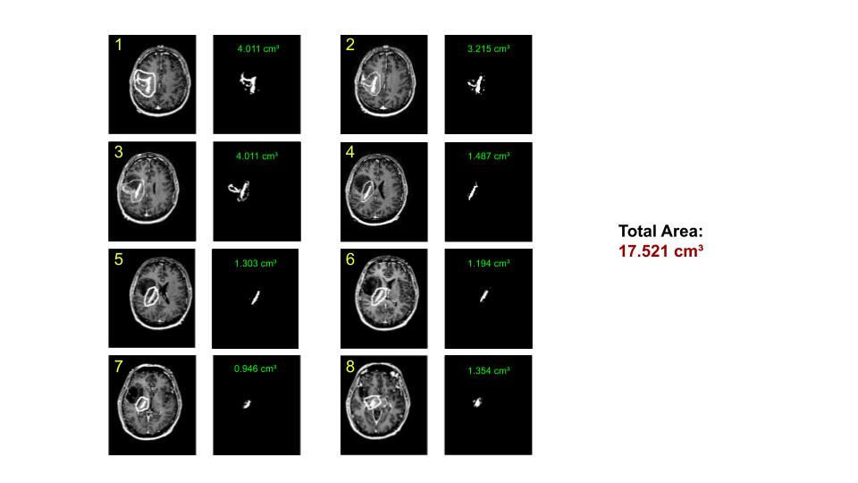

# brain-tumor-segmentation

Calculates the volume of a brain tumor from a sequence of MRI images outlining the tumor, and knowledge about the MRI device.

## Usage

        python tumor_size.py [-h] [--scan_shape SCAN_SHAPE [SCAN_SHAPE ...]]
        [--seg_width SEG_WIDTH]
        dir

## Test

        python tumor_size.py mri/

## Tumor Area Calculation

